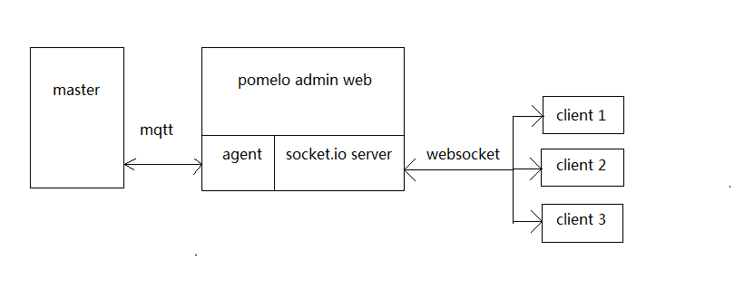

# pomelo-admin-web
pomelo-admin-web is a web console for [pomelo](https://github.com/NetEase/pomelo). it is based on [pomelo-admin](https://github.com/NetEase/pomelo-admin). it is just an web console example, you can implement your style like web console.      

##Installation
```
npm install pomelo-admin-web  
```
##Usage
just run  
```
node app.js
```

open browser in your computer,and enjoy it 


socket.io server

ajax --> socket.io server --> master server



支持pomelo 2.2.5 版本

配置文件
```
config/admin.json

{
	"host": "localhost",  //本机上就是 localhost 
	"port": 7001,    
	"username": "monitor",
	"password": "monitor",
	"adminhost": "localhost",  // pomelo服务器的master进程的服务器ip
	"adminport": 3005,  // pomelo服务器的master进程的服务器端口
	"adminusername": "monitor",
	"adminpassword": "monitor"
}
```
